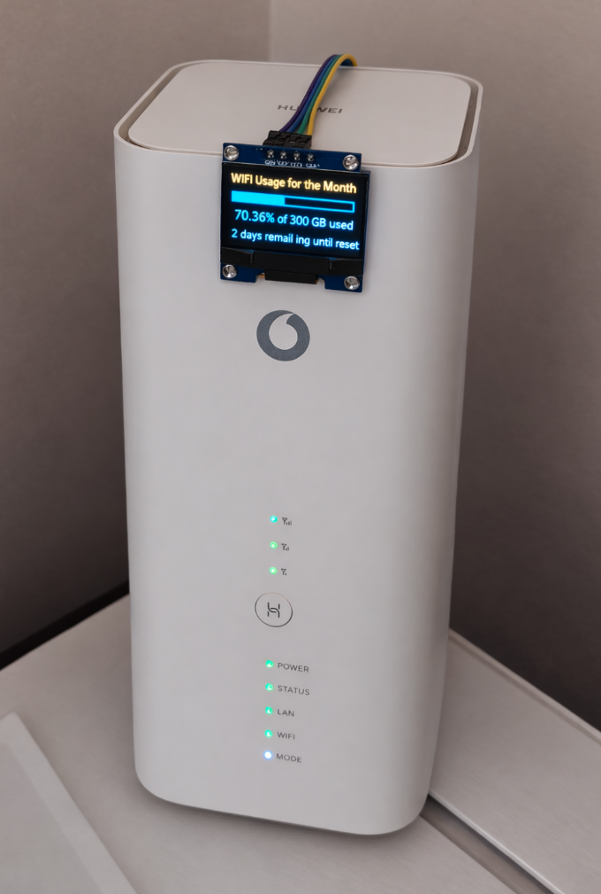
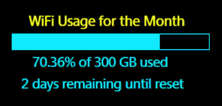
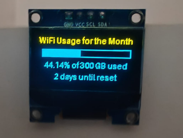

# WiFi Usage Monitor: Raspberry Pi OLED Display

## Overview

A Raspberry Pi Zero 2 WH polls a local router API for monthly broadband usage statistics and renders a live progress bar on a 128×64 I²C OLED display. Mounted on the router, it provides continuous visibility of consumption against a defined monthly cap without requiring browser access or external services.

Fully local, headless, self-starting, resilient to router outages, low power.



---

## Display Output
```
        WiFi Usage for the Month
     █████████████████████________|
          70.36% of 300 GB used
       2 days remaining until reset
```




---

## System Requirements

### Hardware

| Component | Specification |
|---|---|
| SBC | Raspberry Pi Zero 2 WH |
| Display | SSD1306/SSD1309 128×64 OLED (I²C) |
| Wiring | 4x female-to-female jumper wires |
| Power | Micro-USB power supply |

### Wiring

| OLED Pin | Raspberry Pi Pin |
|---|---|
| VCC | Pin 1 (3.3V) |
| GND | Pin 6 (Ground) |
| SCL | Pin 5 (GPIO3) |
| SDA | Pin 3 (GPIO2) |

No soldering required.

---

## Architecture

1. Pi boots
2. Python script authenticates to router
3. Monthly statistics endpoint is queried
4. Download + upload byte totals are extracted
5. Percentage of monthly cap is calculated
6. OLED renders title, progress bar, percentage used, days until reset
7. Script sleeps for defined interval, loop repeats

---

## Configuration

| Parameter | Description |
|---|---|
| `BASE_URL` | Router base IP |
| `PASSWORD` | Router web interface password |
| `DATA_LIMIT` | Monthly cap in bytes (default: 300 GB) |
| `MAX_RETRIES` | Retry attempts on API failure |
| `REFRESH_SECONDS` | Polling interval in seconds |

---

## Implementation
```python
#!/usr/bin/env python3
import time
import requests
from datetime import datetime, timedelta, date

from luma.core.interface.serial import i2c
from luma.oled.device import ssd1309
from luma.core.render import canvas
from PIL import ImageFont

# --- Config ---
BASE_URL = "http://<router_IP>"
LOGIN_URL = f"{BASE_URL}/html/index.html"
STATS_URL = f"{BASE_URL}/api/monitoring/month_statistics"
PASSWORD = "<Password>"
DATA_LIMIT = 300 * 1024**3
MAX_RETRIES = 3
REFRESH_SECONDS = 600

# --- OLED init ---
serial = i2c(port=1, address=0x3C)
device = ssd1309(serial, width=128, height=64)
device.contrast(255)
device.clear()
font = ImageFont.load_default()

def parse_between(s, a, b):
    i = s.find(a)
    if i == -1:
        return None
    i += len(a)
    j = s.find(b, i)
    return None if j == -1 else s[i:j]

def days_until_next_month():
    today = date.today()
    first_next_month = (today.replace(day=28) + timedelta(days=4)).replace(day=1)
    return (first_next_month - today).days

def fetch_usage_percentage():
    session = requests.Session()

    for _ in range(MAX_RETRIES):
        try:
            session.post(
                LOGIN_URL,
                data={"Password": PASSWORD},
                headers={"Content-Type": "application/x-www-form-urlencoded"},
                timeout=5,
            )

            r = session.get(STATS_URL, timeout=5)
            r.raise_for_status()
            xml = r.text

            dl = parse_between(xml, "<CurrentMonthDownload>", "</CurrentMonthDownload>")
            ul = parse_between(xml, "<CurrentMonthUpload>", "</CurrentMonthUpload>")

            if dl is not None and ul is not None:
                total = int(dl) + int(ul)
                return (total / DATA_LIMIT) * 100.0

        except Exception:
            continue

    return None

def center_x(draw, text):
    bbox = draw.textbbox((0, 0), text, font=font)
    w = bbox[2] - bbox[0]
    return (device.width - w) // 2

def draw_screen(usage_percentage, days_remaining, error=False):
    title = "WiFi Usage for the Month"

    with canvas(device) as draw:
        draw.text((center_x(draw, title), 0), title, font=font, fill=255)

        if error or usage_percentage is None:
            msg1 = "No data from router"
            msg2 = datetime.now().strftime("%H:%M:%S")
            draw.text((center_x(draw, msg1), 24), msg1, font=font, fill=255)
            draw.text((center_x(draw, msg2), 40), msg2, font=font, fill=255)
            return

        used = max(0.0, min(usage_percentage, 100.0))
        line2 = f"{used:.2f}% of 300 GB used"
        line3 = f"{days_remaining} days until reset"

        bar_x = 4
        bar_y = 16
        bar_width = 120
        bar_height = 10
        filled_width = int(bar_width * used / 100.0)

        draw.rectangle(
            (bar_x, bar_y, bar_x + bar_width, bar_y + bar_height),
            outline=255,
            fill=0,
        )

        if filled_width > 0:
            draw.rectangle(
                (bar_x, bar_y, bar_x + filled_width, bar_y + bar_height),
                outline=255,
                fill=255,
            )

        draw.text((center_x(draw, line2), 32), line2, font=font, fill=255)
        draw.text((center_x(draw, line3), 48), line3, font=font, fill=255)

def main_loop():
    while True:
        days_remaining = days_until_next_month()
        usage = fetch_usage_percentage()
        draw_screen(usage, days_remaining, error=(usage is None))
        time.sleep(REFRESH_SECONDS)

if __name__ == "__main__":
    main_loop()
```

---

## Autostart on Boot
```bash
crontab -e
```
```
@reboot nohup python3 /home/WIFI.py >/home/wifi.log 2>&1 &
```

Provides automatic recovery after power loss, background execution, and log capture for debugging.

---

## Failure Handling

| Scenario | Behaviour |
|---|---|
| Router unreachable | Retries up to `MAX_RETRIES`, then renders error screen with timestamp |
| Partial API response | Skipped, retried on next poll cycle |
| Usage exceeds 100% | Clamped to 100% |
| Power loss | Script restarts on boot via cron |
| SSH session closed | Continues via `nohup` |

---

## Known Limitations

- API endpoint is Huawei-specific. Other router models require endpoint and XML tag changes.
- No historical data storage.
- Credentials stored in plaintext. Do not expose the script in a public repository without redacting.
- No fallback to last known good value on repeated API failure.